ℹ️  Generando arquitectura avanzada para: Credibanco App Angular (Angular)
# Arquitectura - Credibanco App Angular

## 🏗️ Visión General

Credibanco App Angular es una aplicación frontend moderna desarrollada en Angular que implementa una arquitectura modular y escalable, siguiendo las mejores prácticas de desarrollo frontend.

## 📊 Diagrama de Arquitectura Detallado

```mermaid
graph TB
    %% User Interface
    User[👤 Usuario]
    Browser[🌐 Navegador Web]
    
    subgraph "📱 Credibanco App Angular Angular Application"
        subgraph "🎨 Presentation Layer"
            SmartComp[🧠 Smart Components<br/>Container Components]
            DumbComp[🎭 Dumb Components<br/>Presentation Components]
            SharedComp[🔄 Shared Components<br/>Reusable UI Elements]
            UILib[🎨 UI Library<br/>Angular Material]
        end
        
        subgraph "🧠 Application Layer"
            Services[⚙️ Services<br/>Business Logic]
            Interceptors[🔌 HTTP Interceptors<br/>Request/Response Handling]
            Guards[🛡️ Route Guards<br/>Auth & Authorization]
            Store[🗄️ State Store<br/>NgRx Store]
            Validators[✅ Validators<br/>Form Validation]
        end
        
        subgraph "🔄 Data Layer"
            HttpClient[🌐 HTTP Client<br/>API Communication]
            DataServices[📊 Data Services<br/>Data Access Layer]
            Models[📋 Models/Interfaces<br/>TypeScript Types]
            Cache[💾 Caching<br/>Memory & LocalStorage]
        end
        
        subgraph "🛠️ Infrastructure"
            Router[🗺️ Angular Router<br/>Navigation]
            LazyLoad[⚡ Lazy Loading<br/>Code Splitting]
            Config[⚙️ Environment Config<br/>Build Configuration]
            ErrorHandler[🚨 Error Handler<br/>Global Error Handling]
        end
    end
    
    %% External Systems
    API[🔌 Backend APIs<br/>REST/GraphQL]
    CDN[📦 CDN<br/>Static Assets]
    Analytics[📊 Analytics<br/>Google Analytics]
    
    %% Flow Connections
    User --> Browser
    Browser --> SmartComp
    SmartComp --> DumbComp
    SmartComp --> SharedComp
    DumbComp --> UILib
    SharedComp --> UILib
    
    SmartComp --> Services
    Services --> Interceptors
    Services --> Guards
    Services --> Store
    SmartComp --> Store
    Services --> Validators
    
    Services --> HttpClient
    HttpClient --> DataServices
    DataServices --> Models
    DataServices --> Cache
    
    SmartComp --> Router
    Router --> LazyLoad
    Services --> Config
    Services --> ErrorHandler
    
    %% External connections
    HttpClient --> API
    Browser --> CDN
    Browser --> Analytics
    
    %% Styling
    classDef presentation fill:#e3f2fd,stroke:#0277bd,stroke-width:2px
    classDef application fill:#f1f8e9,stroke:#388e3c,stroke-width:2px
    classDef data fill:#fff3e0,stroke:#f57c00,stroke-width:2px
    classDef infrastructure fill:#fce4ec,stroke:#c2185b,stroke-width:2px
    classDef external fill:#f3e5f5,stroke:#7b1fa2,stroke-width:2px
    
    class SmartComp,DumbComp,SharedComp,UILib presentation
    class Services,Interceptors,Guards,Store,Validators application
    class HttpClient,DataServices,Models,Cache data
    class Router,LazyLoad,Config,ErrorHandler infrastructure
    class User,Browser,API,CDN,Analytics external
```

## 🔧 Componentes Principales

### 🎨 Presentation Layer (UI Components)
- **Smart Components**: Componentes contenedores con lógica de negocio
- **Dumb Components**: Componentes de presentación reutilizables
- **Shared Components**: Componentes compartidos entre módulos
- **UI Library**: Biblioteca de componentes base (Angular Material)
- **Responsive Design**: Diseño adaptativo para múltiples dispositivos

### 🧠 Application Layer (Services & Logic)
- **Services**: Servicios de aplicación y lógica de negocio
- **HTTP Interceptors**: Interceptores para manejo de requests/responses
- **Guards**: Guardias de rutas para autenticación y autorización
- **State Management**: Gestión de estado con NgRx Store
- **Validators**: Validadores personalizados para formularios

### 🔄 Data Layer (Data Management)
- **HTTP Client**: Cliente HTTP para comunicación con APIs
- **Data Services**: Servicios de acceso a datos
- **Models/Interfaces**: Modelos de datos TypeScript
- **Caching**: Cache de datos en memoria y localStorage

### 🛠️ Infrastructure Layer
- **Routing**: Enrutamiento con Angular Router
- **Lazy Loading**: Carga perezosa de módulos
- **Build System**: Sistema de build con Angular CLI
- **Environment Config**: Configuración por entornos
- **Error Handling**: Manejo global de errores

## 🏗️ Arquitectura Modular

### 📦 Core Modules
- **Core Module**: Servicios singleton y configuración global
- **Shared Module**: Componentes, pipes y directivas compartidas
- **Feature Modules**: Módulos de funcionalidades específicas
- **Lazy Modules**: Módulos cargados bajo demanda

## 🎨 Patrones de Diseño Frontend

### 🏛️ Architectural Patterns
- **Component-Based Architecture**: Arquitectura basada en componentes
- **Smart/Dumb Components**: Separación de lógica y presentación
- **Flux/Redux Pattern**: Flujo unidireccional de datos con NgRx

### 🔧 Design Patterns
- **Observer Pattern**: Observables y subscripciones RxJS
- **Dependency Injection**: Inyección de dependencias Angular
- **Facade Pattern**: Servicios como fachadas de APIs
- **Strategy Pattern**: Diferentes estrategias de validación

## 🚀 Características Técnicas

### ⚡ Performance Optimization
- **OnPush Change Detection**: Optimización de detección de cambios
- **Lazy Loading**: Carga perezosa de módulos y componentes
- **Tree Shaking**: Eliminación de código no utilizado
- **Bundle Splitting**: División de bundles para carga optimizada

### 📱 User Experience
- **Responsive Design**: Diseño adaptativo con CSS Grid/Flexbox
- **Progressive Enhancement**: Mejora progresiva de funcionalidades
- **Accessibility**: Cumplimiento de estándares WCAG

### 🛡️ Security & Best Practices
- **Content Security Policy**: Políticas de seguridad de contenido
- **XSS Protection**: Protección contra Cross-Site Scripting
- **HTTPS Only**: Comunicación segura exclusivamente
- **Input Sanitization**: Sanitización de entradas de usuario
