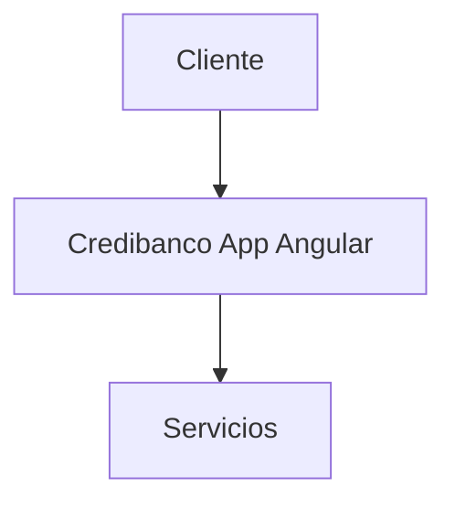

# Arquitectura - Credibanco App Angular

## 🏗️ Visión General

Aplicación frontend desarrollada en Angular basado en Angular.

## 🔧 Componentes

### Core Components
- Módulos principales
- Servicios
- Configuración

## 📊 Diagrama de Arquitectura

## 🚀 Tecnologías

- **Stack Principal**: Angular
- **Puerto**: 4200
- **Tipo**: Frontend
