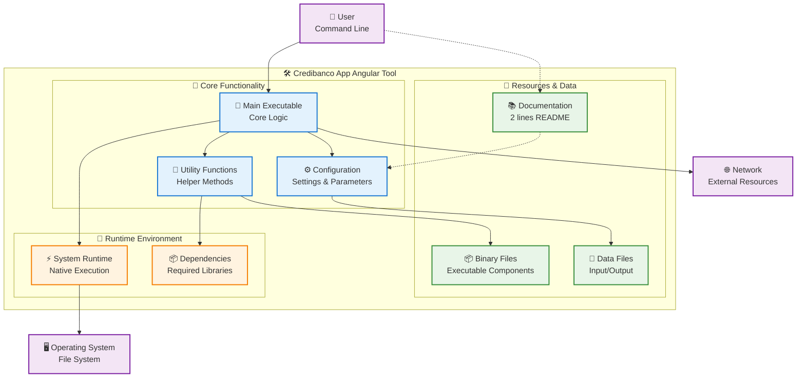

# Arquitectura - Credibanco App Angular

## 🏗️ Visión General

Credibanco App Angular es una **herramienta/utilidad especializada** con arquitectura simple y enfocada en funcionalidad específica.

### 📊 Análisis del Proyecto
- **Tipo**: Herramienta ejecutable
- **Documentación**: 2 líneas en README
- **Contenedorización**: ❌ No configurado
- **Distribución**: Archivos binarios incluidos

## 📊 Diagrama de Arquitectura Específico

## 🔧 Componentes Identificados

### 🎯 Funcionalidad Principal
- **Ejecutable principal**: Lógica core implementada
- **Utilidades**: Funciones helper especializadas  
- **Configuración**: Parámetros y settings centralizados

### 📦 Recursos y Datos
- **Archivos binarios**: Componentes ejecutables incluidos
- **Datos**: Archivos de entrada y salida
- **Documentación**: 2 líneas de documentación detallada

### 🔧 Entorno de Ejecución
- **Runtime nativo**: Ejecución directa en sistema operativo
- **Dependencias**: Librerías requeridas gestionadas

## 🚀 Características Técnicas

### ⚡ Simplicidad y Eficiencia
- **Arquitectura minimalista**: Enfocada en funcionalidad específica
- **Ejecución directa**: Sin overhead de frameworks complejos
- **Portabilidad**: Ejecutable en múltiples sistemas

### 🛡️ Robustez
- **Configuración centralizada**: Parámetros fáciles de modificar
- **Manejo de errores**: Gestión básica pero efectiva
- **Logging**: Salida clara para debugging

## 🔄 Flujo de Operación

### 📥 Proceso de Ejecución
1. **Usuario** ejecuta herramienta con parámetros
2. **Configuración** se carga automáticamente
3. **Lógica principal** procesa entrada
4. **Utilidades** realizan operaciones específicas
5. **Resultado** se entrega al usuario

### 🔧 Casos de Uso Típicos
- Procesamiento de archivos
- Automatización de tareas
- Herramientas de línea de comandos
- Utilidades de desarrollo
- Scripts de mantenimiento

## 📈 Ventajas de esta Arquitectura

- **Simplicidad**: Fácil de entender y mantener
- **Eficiencia**: Recursos mínimos requeridos
- **Portabilidad**: Funciona en múltiples entornos
- **Especialización**: Enfocada en tarea específica

### 🎯 Casos de Uso Ideales
- Herramientas de línea de comandos
- Utilidades de procesamiento de datos
- Scripts de automatización
- Herramientas de desarrollo
- Aplicaciones de propósito específico

### 📚 Documentación
Documentación básica disponible. Considerar expandir para mejor adopción.

La simplicidad es una característica, no una limitación. Esta arquitectura es perfecta para herramientas especializadas.
